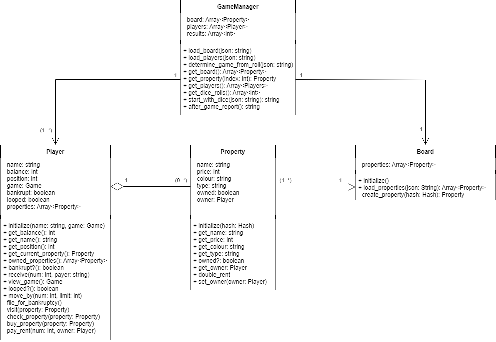

# My Implementation of Woven Monopoly
## Access two different versions of this game:
### **The 'Straight to the Point' version**
This is the main version and is on the '[**master**](https://github.com/dagbay/woven_monopoly/tree/master)' branch where it only outputs the end result of each game. 
### **The 'Print Each Action' version**
This version is on the '[**puts_version_of_the_game**](https://github.com/dagbay/woven_monopoly/tree/puts_version_of_the_game)' branch where each dice roll gets printed on the console.
## How to run the game:
Make sure you are in the main folder of where you saved the repository:
```
cd ./path_to/woven_monopoly
```
To run the game you just simply type in the console:
```
ruby lib/main.rb
```
## How to test the game:
To test the game, make sure you have RSpec globally installed on your system:
```
gem install rspec
```
Go to the main folder of where you saved the repository:
```
cd ./path_to/woven_monopoly
```
Then simply type in the console:
```
bundle exec rspec
```
If you want to test a specific file repo. Simply type:
```
bundle exec rspec spec/features/name_of_spec.rb
```
## UML Class Diagram:

## Sources:
### [ChatGPT](chat.openai.com/chat)
- Generated RSpec boilerplates